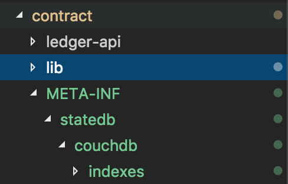
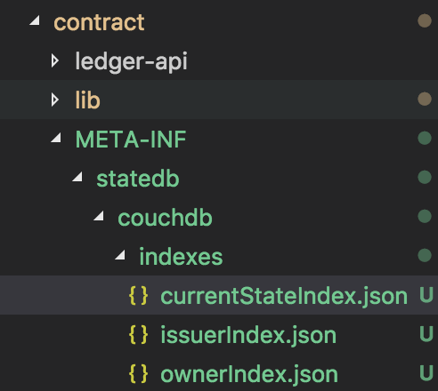
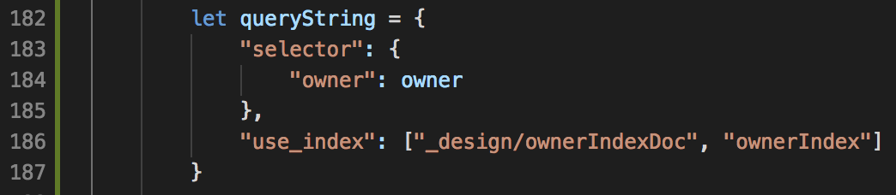
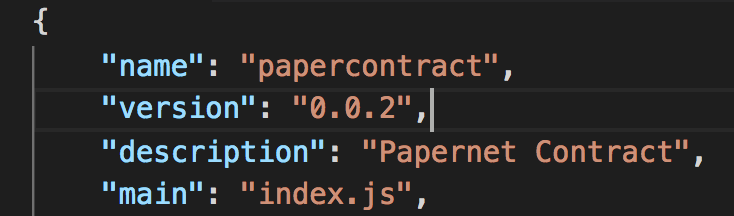
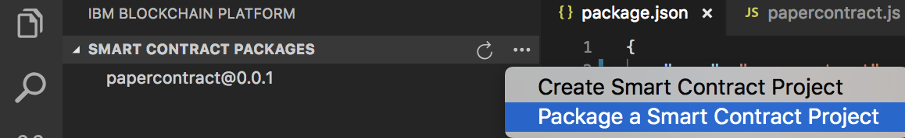
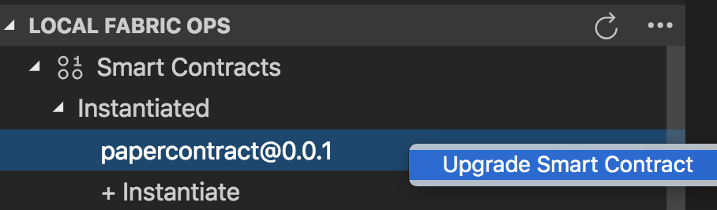
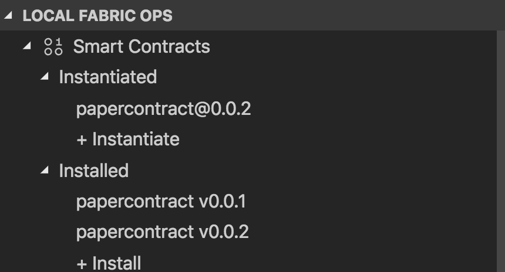
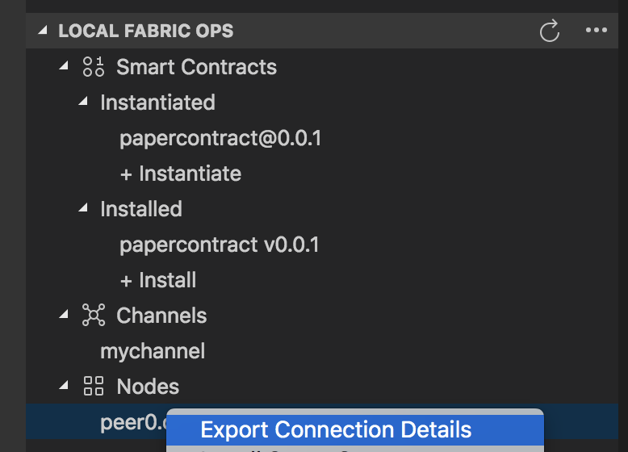
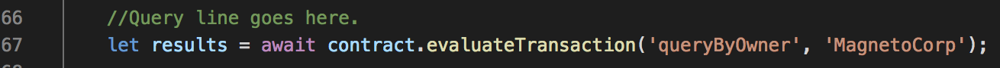
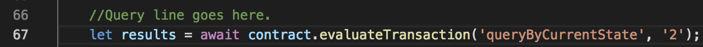

# Exploring the Querying Capability of Hyperledger Fabric 1.4

In this pattern we will take a look at how you can query the world state of a peer within Hyperledger Fabric. Querying the world state is useful for seeing the current state of the assets in the network. For this pattern we will be using the commercial paper use case from the [Hyperledger Fabric 1.4 documentation](https://hyperledger-fabric.readthedocs.io/en/release-1.4/developapps/scenario.html).

During this pattern you’ll go through the process of creating indexes for the CouchDB world state database. You’ll then update the smart contract to include the logic to query the world state utilizing the newly created indexes. After updating and redeploying the smart contract you will then simulate 100 transactions to populate the world state with assets. Lastly, we will run a few queries utilizing the Node.js SDK and view the results that were returned.

### What are database indexes?

In order to understand indexes, let's take a look at what happens when you query the world state. Say, for example, you want to find all assets owned by the user, "Bob". The database will search through each json document in the database one by one and return all documents that match user = "bob. This might not seem like a big deal but consider if you have millions of documents in your database. These queries might take a while to return the results as the database needs to go through each and every document. With indexes you create a reference that contains all the values of a specific field and which document contains that value. What this means is that instead of searching through every document, the database can just search the index for occurrences of the user "bob" and return the documents that are referenced. 

It's important to note that every time a document is added to the database the index needs to be updated. Normally in CouchDB this is done when a query is received but in Hyperledger Fabric the indexes are updated every time a new block is committed which allows for faster querying. This is a process known as **index warming**.

# Flow

1. Package, Install, and Instantiate smart contract
2. Create indexes
3. Add query logic
4. Upgrade smart contract
5. Simulate transactions to populate world state
6. Query world state


## Prerequisites 

- Install [VSCode](https://code.visualstudio.com/)
- Install the [IBM Blockchain platform extension for VSCode](https://github.com/IBM-Blockchain/blockchain-vscode-extension)
- [Node v8.x and npm v5.x](https://nodejs.org/en/download/)
- [Yeoman (yo) v2.x](http://yeoman.io/)
- [Docker version v17.06.2-ce or greater](https://www.docker.com/get-docker)
- [Docker Compose v1.14.0 or greater](https://docs.docker.com/compose/install/)

# Steps

### 1. Deploy the commercial paper smart contract
As mentioned before, this pattern extends the commercial paper example so we will need to package, install, and instantiate it before we do anything else.

Follow the instructions in the [setup.md](setup.md) document to get your local environment up and running with the commercial paper smart contract. 

### 2. Create indexes for those commonly used queries
In the commercial paper use case we will be querying by issuer, by owner, and by the current state of each asset.

1. First, create a directory under the **contract** directory of magnetocorp and name the new directory **META-INF**.
2. Then, in the new directory, create another new directory named **statedb**
3. After that, create a new directory inside of **statedb** called **couchdb**
4. Next, you guessed it, create a new directory inside of **couchdb** and name it **indexes**

The directory structure should look like the image below.



1. Now we can start creating our index definitions. Create a new file in the **indexes** directory and name it **issuerIndex.json**
2. Then, copy the following code into that file:

```javascript
{
    "index": {
        "fields": [ "issuer"]
    },
    "ddoc": "issuerIndexDoc",
    "name": "issuerIndex",
    "type": "json"
}
```

This file states that the index will:
- keep track of the *issuer* field of each document
- store this index in a design document (ddoc) named *issuerIndexDoc*
 - is named issuerIndex
- will be in json format

Now let's create two more.

3. Create a new file in the **indexes** directory and name it **ownerIndex.json**
4. Then, copy the following code into that file:

```javascript
{
    "index": {
        "fields": ["owner"]
    },
    "ddoc": "ownerIndexDoc",
    "name": "ownerIndex",
    "type": "json"
}
```

This index is very similar to the previous one for the issuer field but instead we are indexing the *owner* field.

5. Finally, create one last file in the **indexes** directory and name it **currentStateIndex.json**
6. Then, copy the following code into that file:

```javascript
{
    "index": {
        "fields": [ "currentState"]
    },
    "ddoc": "currentStateIndexDoc",
    "name": "currentStateIndex",
    "type": "json"
}
```

Your directory structure should now look like this:



And that's all it takes to build indexes. These indexes will be deployed next time the smart contract is installed and instantiated.

### 3. Implement query transactions in the smart contract

Now we need to implement the query logic in the transactions of the smart contract. These transactions will be invoked by the Node SDK to execute our queries.

1. Using VSCode, open the [papercontract.js](./papercontract.js) file found in this pattern repo
2. Replace the contents of **contract/lib/papercontract.js** with the new [papercontract.js](./papercontract.js)

This updated contract already has the query logic added. Let's take a look at the transactions that were added.

- queryByIssuer, queryByOwner, and queryByCurrentState - These transactions are all similar in that they take one parameter and query the respective fields in the database. If you look at the *queryString* for each transaction, you will notice that they are pointing to the design documents that hold the indexes that were created earlier. This query string is then passed to *queryWithQueryString* to be executed.

- queryAll - This transaction does what it says. It gets all asset states from the world state database. This query string is then passed to *queryWithQueryString* to be executed.

- queryWithQueryString - This function receives a query string as a parameter and is called by other transactions in the contract to do the actual querying. You can also do ad hoc queries with this transaction by passing in your own query strings.

Let's take a closer look at the code involved in making these queries.

Open the new [papercontract.js](./papercontract.js) in VS Code and go to line 182 



Take a look at how the `queryString` is structured. The `selector` property is where you specify which field of the asset state you want to search against. In the case of our `queryByOwner` transaction, we are searcing against the `owner` field and passing in a variable that represents the owner that we want to search for (e.g. `MagnetoCorp`)

The next property to note is `use_index` which allows you to specify a design document and index to use for the query.


### 4. Upgrading the deployed contract
Since we made changes to the smart contract we now need to re-deploy it to the peer.

1. Open up [contract/package.json](./contract/package.json) in VS Code

2. Change the *version* property to **0.0.2** and save the file.



3. Click on the IBM Blockchain extension icon on the left side of VS Code.

4. Package the contract again by clicking on three dot menu button at the top of the *Smart Contract Packages* section on the upper left side and selecting **Package a Smart Contract Project**.

If necessary, specify to create the package from the **contract** folder.



5. Next, go to the **Local Fabric Ops** section and find the instantiated **papercontract@0.0.1**. Right click on it and select **Upgrade Smart Contract**



6. In the dialog, select the newly installed papercontract@0.0.2.

7. Select the peer that you'd like to install the smart contract to. There should only be one option.

8. When asked about what function you'd like to call, enter **instantiate**

9. Then when it asks for arguments to pass, just press enter without typing anything.

10. If successful, you should now see **papercontract@0.0.2** in the **Local Fabric Ops** section under **Instantiated**




### 5. Query the world state with the Node.js SDK

Before we run the query program we need to do a few things first:
- Install dependencies
- Export the connection details and create the wallet
- Populate the world state

#### 1. Installing dependencies
1. From the terminal, cd into the **application** directory of this repo. 
2. Run `npm install` 

#### 2. Exporting connection details and creating the wallet
1. From the IBM Blockchain Platform extension, go to the **Local Fabric Ops** section and expand the **Nodes** category.
2. Right click on `peer0.org1.example.com` and select **Export Connection Details**



3. In the dialog that appears select the **queryPattern** folder

This process will export the connection profile which has the necessary information our application will need to interact with our blockchain network, and a wallet will be created that contains an admin identity. 

4. Switch back to the Explorer view by clicking on the paper icons at the top left of VS Code.

5. You should now notice a new folder added under the **queryPattern** directory called **local_fabric**.

#### 3. Populate the world state
Right now our world state is empty and there is nothing to query. Let's add some entries to the ledger so that we can see some results when we run the queries.

1. From the termainal and while in the **application** folder, run `node setup.js`

This will run through a variety of transactions to populate the ledger. The process will take about 2-3 minutes. While this is running, take a look at the **setup.js** file from within VS Code to see what the transactions are doing.

#### 4. Query the world state
Now we can finally get around to querying the world state.

1. From the terminal, run `node query.js`

This query will return absolutely everything that is in the world state. While this might be valuable in some situations, in most cases you will want to search based on certain criteria such as by owner or by status.

2. From the terminal, run `node queryByOwner.js`

This query will return all assets that are currently owned by MagnetoCorp. If you take a look at the `queryByOwner.js` file in VS Code you can see in line 67 that we are calling the `queryByOwner` transaction defined in the `papercontract.js` file and that we are passing in `MagnetoCorp` as the only argument. You can easily change `MagnetoCorp` to `DigiBank` and rerun the query to get all assets owned by DigiBank instead.



3. From the termainl, run `node queryByCurrentStatus.js`

This query will return all commercial papers that have been bought. If you take a look at `queryByCurrentStatus.js` in VS Code you can see in line 67 that this time we are calling the `queryByCurrentStatus` transaction in `papercontract.js` and passing in the status code of 2 as the only parameter. The status codes for the commercial papers are as follows:

- 1 = issued
- 2 = bought
- 3 = redeemed



It's also worth noting that to call the transactions in these query files we are using the `contract.evaluateTransaction()` method instead of `contract.submitTransaction()`. This is becuase `evaluateTransaction` is only evaluated on the endorsing nodes and does not get submitted to the orderer and thus is not ordered into a block or committed. As such this method cannot update the ledger and is only used for querying.

### Summary
In this section we took a look at how querying works in a Hyperledger Fabric network with CouchDB as the state database. First, we created indexes for commonly used queries. Then, we added the query logic to the smart contract. Finally, we ran some queries and took a look at what the world state contained.

## License

This code pattern is licensed under the Apache License, Version 2. Separate third-party code objects invoked within this code pattern are licensed by their respective providers pursuant to their own separate licenses. Contributions are subject to the [Developer Certificate of Origin, Version 1.1](https://developercertificate.org/) and the [Apache License, Version 2](https://www.apache.org/licenses/LICENSE-2.0.txt).

[Apache License FAQ](https://www.apache.org/foundation/license-faq.html#WhatDoesItMEAN)