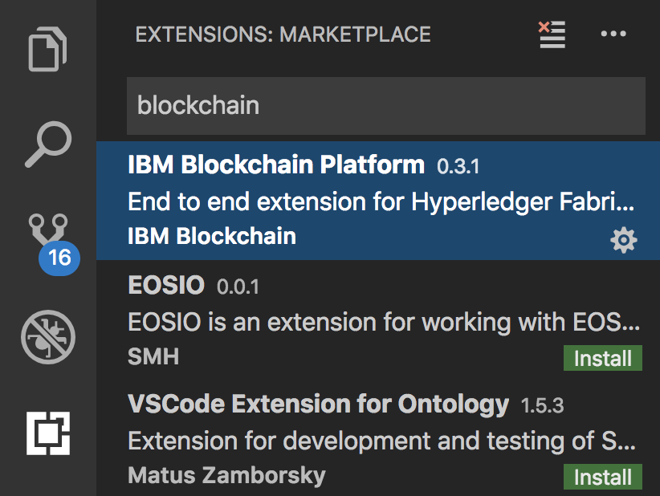
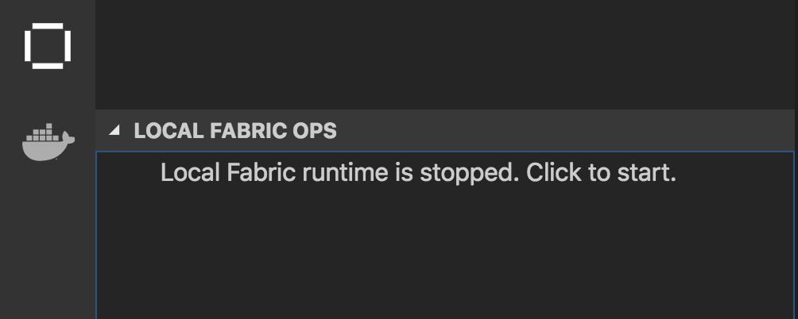
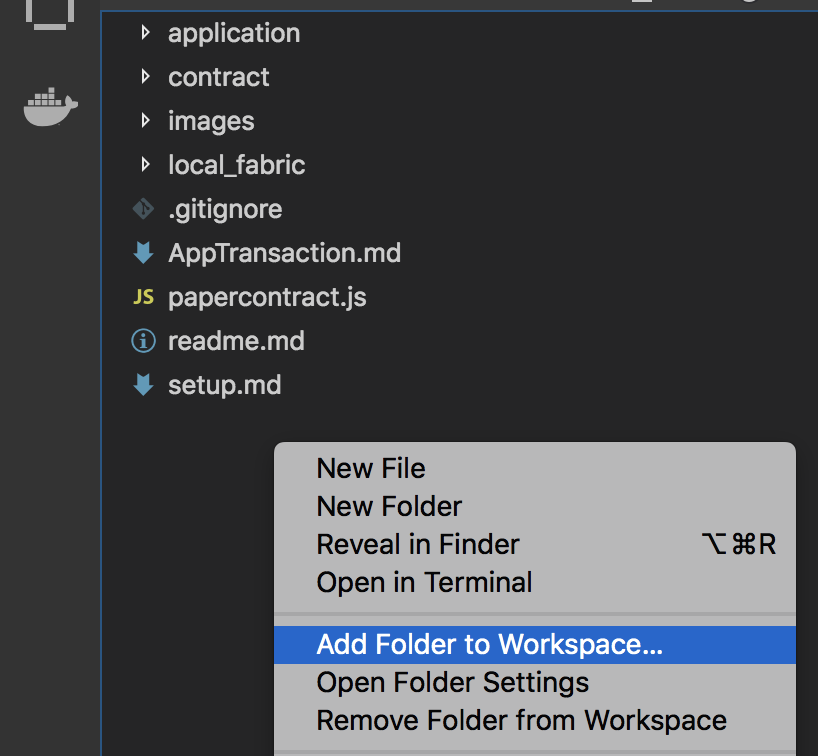
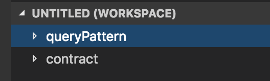
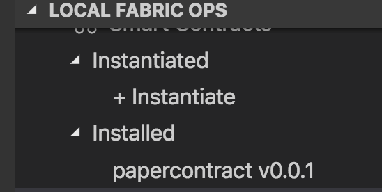
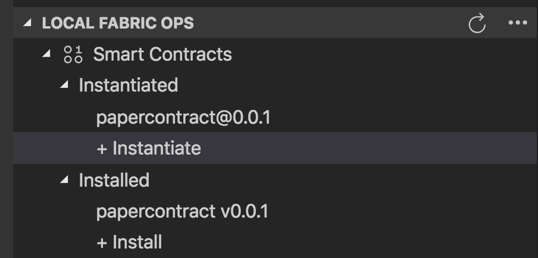

## Deploying paper contract 
This document will take you through the process of deploying the paper contract chaincode to a local Hyperledger Fabric network. This process is required in order to complete the rest of the pattern. 

### 1. Setting up your environmnet
#### Step 1. Starting VS Code
Start VS Code by running the command `code` from the terminal. 
Verify the installation under the Extensions view.   


Notice the IBM Blockchain platform icon on the side bar.
#### Step 2. Start a local fabric envioronemnt.
Goto the Blockchain platfrom view and click on `Local Fabric runtime is stopped. Click to start.` under **Local Fabric Ops**.



After a few minutes, your network will be up and running.

#### Step 3. Clone this repo. 

1. Open up your terminal and cd into where you'd like to clone the repo. 

2. Then, enter the following command to clone the repo
```bash
git clone https://github.com/odrodrig/queryPattern.git
```

### 2. Deploy the paper contract
In this section, we will deploy the base paper contract that we will be modifying later. 

#### Step 1.
In VSCode, choose File > Open Folder, and select the repo that was cloned in the previous step. 

Then right click in the space under your files in the **Explorer** view and select **Add folder to workspace**



Select the **contract** folder within the repo that was just cloned.

You should now have two directories in your workspace.



#### Step 2.
Explore the `papercontract.js` file, which is located in the `contract/lib` subfolder. It effectively orchestrates the logic for the different smart contract transaction functions (issue, buy, redeem, etc.), and is underpinned by essential core functions (in the sample contract) that interact with the ledger. This [link](https://hyperledger-fabric.readthedocs.io/en/master/tutorial/commercial_paper.html) explains the concepts, themes, and programmatic approach to writing contracts using the commercial paper scenario.

#### Step 3. Package the contract.
1. In the IBM Blockchain Platform extension for VSCode find the **Smart Contract Packages** section.  

2. Hover your mouse over **Smart Contract Packages** and click on the 3 dots that appear to the right of that panel to open up the **More Actions** menu

3. Select **Package a smart contract project**


4. When asked to choose a workspace folder to package, select **contract**

#### Step 5. Install the contract.
1. In the IBM Blockchain Platform extension for VSCode find the **Local Fabric Ops** section 

2. Click on **+ Install** 

3. A new prompt will appear at the top of the editor asking which peer you would like to install the smart contract on. Select `peer0.org1.example.com`

4. When asked which package to install, select **papercontract@0.0.1**

If all is well then you should see **papercontract v0.0.1** under the *Installed* section of *Local Fabric Ops*



#### Step 6. Instantiate the contract
1. In the **Local Fabric Ops** section click on **+ Instantiate** 

2. When asked what channel to instantiate the contract on, click on **mychannel**

3. Select **papercontract v0.0.1** when asked to select a smart contract

4. You will then be prompted to enter a function to call, enter **instantiate** and press enter.

5. The function doesn't require any arguments so you can leave the propmt empty and just press enter.

After a short delay your smart contract will be instantiated on the channel.

If everything went according to plan then you should see *papercontract@0.0.1* listed under the *Instantiated* section of **Local Fabric Ops**



In the next section we will learn to run indexed queries against the world state database.

[>> Back to the README](readme.md)
 